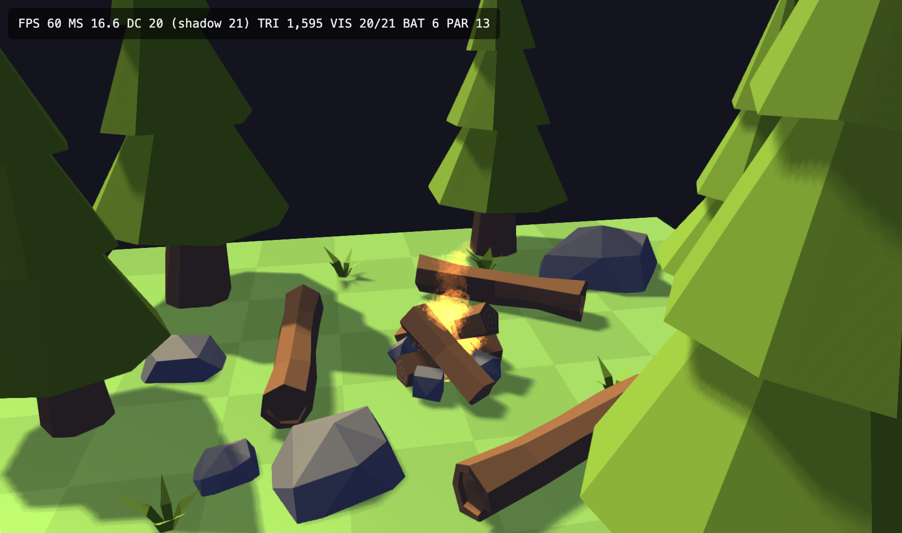

# FlatGL

An opinionated WebGL 2.0 engine for games and game-like apps. Zero runtime dependencies — just TypeScript and direct WebGL2 API calls.

 



## Features

- **ECS architecture** — entities, components, and type-safe queries via `World`
- **Single entry point** — `Engine.create()` wires the full 3-pass pipeline internally
- **Shadow mapping** — one directional light with PCF soft shadows
- **FXAA post-processing** — anti-aliasing + optional contrast/saturation grade
- **Frustum culling** — camera and light frustums, bounding spheres auto-computed from mesh geometry
- **Camera** — perspective (default) or orthographic, follows `camera.target`
- **Keyboard + mouse input** — `engine.input` with `mouseWorld` unprojected to the Y=0 ground plane; scroll wheel zoom
- **Script behaviours** — `onStart` / `onUpdate` / `onDestroy` lifecycle per entity
- **Particle system** — GPU-instanced billboard particles with per-particle physics, size/color lerp, and additive or alpha blending
- **Transform hierarchy** — parent entity references; child transforms inherit parent TRS
- **OBJ loader** — positions, normals, and UVs with flat-normal fallback
- **PNG textures** — load via URL or raw `Uint8Array`
- **Stats overlay** — real-time FPS, draw calls, culling stats, triangle count, particle count
- **Bounding sphere debug** — visualise per-entity bounding spheres as line circles

## Quickstart

```typescript
import { Engine, Script, Transform, Vec3, ObjLoader } from 'flatgl';
import type { ScriptBehaviour, Entity, World } from 'flatgl';

const engine = Engine.create({
  canvas: document.getElementById('glcanvas') as HTMLCanvasElement,
  light: { direction: new Vec3(1, 2, 1) },
  postProcess: { fxaa: true },
});

const { world, input, assets } = engine;

const mesh = assets.createMesh(ObjLoader.parse(objSource));
const mat = assets.createMaterial({ color: new Vec3(0.9, 0.8, 0.6) });

class PlayerMove implements ScriptBehaviour {
  onUpdate(entity: Entity, w: World, dt: number): void {
    const t = w.get(entity, Transform)!;
    const dx = (input.isDown('d') ? 1 : 0) - (input.isDown('a') ? 1 : 0);
    const dz = (input.isDown('s') ? 1 : 0) - (input.isDown('w') ? 1 : 0);
    const move = new Vec3(dx, 0, dz);
    if (move.length() > 0) {
      const dir = move.normalize();
      t.position = t.position.add(dir.scale(5 * dt));
      t.rotation = new Vec3(0, Math.atan2(dir.x, dir.z), 0);
    }
    engine.camera.target = t.position;
  }
}

const player = world.create();
world.add(player, mesh);
world.add(player, mat);
world.add(player, new Transform());
world.add(player, new Script(new PlayerMove()));

const stop = engine.start();
window.addEventListener('beforeunload', () => {
  stop();
  engine.destroy();
});
```

## Public API

### `Engine`

```typescript
Engine.create(options: EngineOptions): Engine

engine.world: World               // ECS container
engine.camera: Camera             // set camera.target to pan
engine.input: InputSnapshot       // keyboard + mouse state (read each frame)
engine.assets: AssetFactory       // mesh, material, texture, emitter creation

engine.start(): () => void        // starts RAF loop, returns stop function
engine.destroyEntity(entity: Entity): void  // fires onDestroy, then removes
engine.showStats(visible?: boolean): void   // toggle real-time stats overlay
engine.showBoundingSpheres(visible?: boolean): void  // toggle debug circles
engine.destroy(): void

// AssetFactory (engine.assets)
engine.assets.createMesh(data: ObjData): Mesh
engine.assets.createMaterial(opts?: MaterialOptions): Material
engine.assets.createTexture(data: Uint8Array, w: number, h: number): Texture
engine.assets.loadTexture(url: string): Promise<Texture>
engine.assets.createParticleEmitter(opts?: ParticleEmitterOptions): ParticleEmitter
```

### `EngineOptions`

```typescript
{
  canvas: HTMLCanvasElement;
  camera?: {
    position?: Vec3;         // default (0,6,10)
    target?: Vec3;           // initial look-at point; default (0,0,0)
    fov?: number;            // default π/4; ignored when orthographic
    near?: number;           // near clipping plane; default 0.1
    far?: number;            // far clipping plane; default 200
    orthographic?: boolean;  // default false
    orthoSize?: number;      // half-height world units; default 8
  };
  light?: {
    direction?: Vec3;        // default (1,2,1).normalize()
    color?: Vec3;            // default (1, 0.88, 0.5)
    intensity?: number;      // default 1.0
    ambient?: number;        // default 0.45
  };
  postProcess?: {
    fxaa?: boolean;          // default true
    contrast?: number;       // default 1.0
    saturation?: number;     // default 1.0
  };
}
```

### `MaterialOptions`

```typescript
{
  color?: Vec3;              // base color tint; default (1,1,1)
  texture?: Texture;         // diffuse texture; default solid white
  specular?: number;         // specular strength 0–1; default 0.3
  receiveShadows?: boolean;  // default true
}
```

### `InputSnapshot`

```typescript
input.isDown(key: string): boolean   // KeyboardEvent.key, e.g. 'w', 'ArrowUp'
input.keys: ReadonlySet<string>
input.mousePixel: { x, y }           // canvas pixel coordinates
input.mouseWorld: Vec3               // unprojected to Y=0 ground plane
input.mouseDown: boolean             // pressed this frame
input.mouseHeld: boolean
input.mouseUp: boolean               // released this frame
input.wheelDelta: number             // scroll wheel accumulator (zoom)
```

### `ScriptBehaviour`

```typescript
interface ScriptBehaviour {
  onStart?(entity: Entity, world: World): void;
  onUpdate(entity: Entity, world: World, dt: number): void;
  onDestroy?(entity: Entity, world: World): void;
}
```

Use `engine.destroyEntity(entity)` instead of `world.destroy()` to ensure `onDestroy` fires.

### `ParticleEmitter`

Attach to any entity to emit GPU-instanced billboard particles. The emitter inherits the parent entity's `Transform`.

```typescript
const emitter = engine.assets.createParticleEmitter({
  maxParticles: 500, // default 500
  rate: 20, // particles per second
  lifetime: 1.5, // seconds
  speed: 2,
  spread: Math.PI / 4, // cone half-angle
  gravity: -1,
  startSize: 0.3,
  endSize: 0,
  startColor: new Vec3(1, 0.6, 0.1),
  endColor: new Vec3(0.5, 0.1, 0),
  startAlpha: 1,
  endAlpha: 0,
  additive: true, // additive blending; false = alpha blend
});

world.add(campfireEntity, emitter);
```

### `Transform` hierarchy

```typescript
const parent = world.create();
world.add(parent, new Transform(new Vec3(0, 0, 0)));

const child = world.create();
const t = new Transform(new Vec3(0, 1, 0));
t.parent = parent; // child inherits parent TRS each frame
world.add(child, t);
```

## Usage as a Library

Build with:

```bash
npm install
npm run build
```

This produces `dist/index.js` (ESM) and `dist/index.d.ts`. Consume via a local path reference:

```json
"dependencies": {
  "flatgl": "file:../flatgl"
}
```

## Demo

```bash
npm run dev:demo
```

Open `http://localhost:8080`. The demo scene includes a campfire with particle effects, rocks, and trees loaded from OBJ + PNG assets.

## Scripts

| Command              | Description                                             |
| -------------------- | ------------------------------------------------------- |
| `npm run build`      | Build the library (`dist/index.js` + `dist/index.d.ts`) |
| `npm run dev`        | Build the library in watch mode                         |
| `npm run build:demo` | One-time build of the demo                              |
| `npm run dev:demo`   | Build demo in watch mode, serve on port 8080            |
| `npm run lint`       | Run ESLint on `src/`                                    |

## Project Structure

```
src/
├── index.ts              # Public API
├── engine/               # Engine, AssetFactory, ScreenPass, Camera, InputSystem
├── core/                 # ECS primitives (World, Entity, System)
├── components/           # Mesh, Material, Transform, Script, ParticleEmitter
├── systems/              # RenderSystem, ShadowSystem, ScriptSystem, ParticleSystem
├── renderer/             # WebGL2 wrappers (Shader, Buffer, Texture, Framebuffer)
├── math/                 # Vec3, Mat4
├── loaders/              # OBJ parser
└── shaders/              # GLSL 3.00 ES (scene, shadow, screen/FXAA, particle, debug)
examples/
├── demo.ts               # Scene with campfire, rocks, and trees
└── assets/               # campfire, rock, tree — .obj + .png each; fire.png particle texture
```

## Rendering Pipeline

1. **Shadow pass** — depth-only render from light's perspective into a 2048×2048 texture; culled against light frustum
2. **Scene pass** — Blinn-Phong shading with PCF soft shadows; culled against camera frustum; material-batched draw calls
3. **Particle pass** — GPU-instanced billboard quads, sorted per emitter; additive or alpha blending
4. **Screen pass** — FXAA anti-aliasing + contrast/saturation grade on a fullscreen quad

## Tech Stack

- **Language:** TypeScript 6 (strict mode, ES2020 target)
- **Build:** tsup (library) + esbuild (demo), with custom loaders for `.glsl`, `.obj`, and `.png`
- **Rendering:** WebGL 2.0 — no external graphics libraries
- **Linting:** ESLint 9 + typescript-eslint + Prettier
